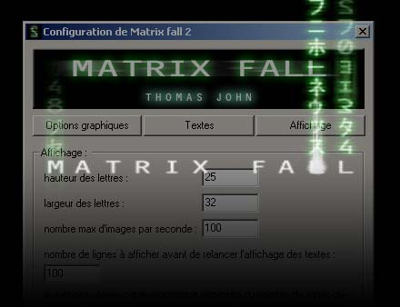



## Matrix fall 2 in DX8 UPDATED

### Description

UPDATED  

now can be used as a screensaver with options : 

-frame rate limit 

-text editing 

-letters scale 

-display mode 

-you can chose between Hardware Acceleration or Reference Rasterizer 

-...

Here is the new version of the fall of the characters of matrix.

It is programmed in DX8 and uses the special characters of the film.

This is the second version and it includes:

- an effect "fall of text" which makes it possible to write text of your choice in the style of matrix

- fade-in and fade-out of the letters

- trail of front and behind the letters

- 4 kinds of lines with random posting

- alphablending

- speed variations

- and more...

- all can be easily configurable

the screenshot shows the text and the trail's effect

if you take time to look at attentively, you will see that it is possible to configure your effect as good seems to you.

I hope that you will like it.

Thomas John

PS : sorry for my english, i speak french

PS2 : the source code is fully commented in french
 
### More Info
 

             |
---                |---
**Submitted On**   |2003-08-14 13:25:38
**By**             |[NoRabbit](https://github.com/Planet-Source-Code/PSCIndex/blob/master/ByAuthor/norabbit.md)
**Level**          |Intermediate
**User Rating**    |5.0 (85 globes from 17 users)
**Compatibility**  |VB 6\.0
**Category**       |[DirectX](https://github.com/Planet-Source-Code/PSCIndex/blob/master/ByCategory/directx__1-44.md)
**World**          |[Visual Basic](https://github.com/Planet-Source-Code/PSCIndex/blob/master/ByWorld/visual-basic.md)
**Archive File**   |[Matrix\_fal1630238152003\.zip](https://github.com/Planet-Source-Code/norabbit-matrix-fall-2-in-dx8-updated__1-47678/archive/master.zip)

